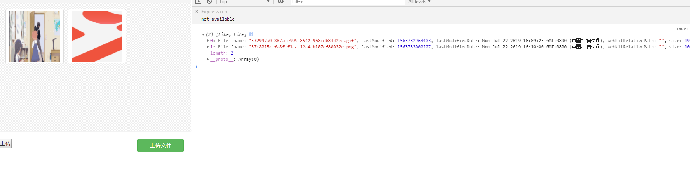

# simpleImageUpload
简单多图片上传


 


初始化 默认上传容量为5 

上传的时候已经改好filename为uuid


## 初始化：

### 外部依赖

```html
 <script src="https://cdn.bootcss.com/jquery/3.4.1/jquery.slim.min.js"></script>
```

### css样式

```css
 <link href="css/simpleImageUpload.min.css" rel="stylesheet">
```

### js

```javascript
 <script src="js/simpleImageUpload.js"></script>
 //位置
 <script>
 	//上传操作
 </script>
 </body>
```


```javascript
<script>

	//init 默认容量为5 不能小于1
	   myFileUpload.init(5);
	
</script>
```


### 获取所有文件：

```javascript
<script>
    //两种方法获取
    
    //1.获取文件 返回格式是map ,key:重命名之后的uuid(不带后缀) ，value:所对应的文件
    
    	 myFileUpload.getFilesMap();
    
    //2.获取文件 返回格式是数组, item项是所对应的文件。
     	 myFileUpload.getFilesArray();
    
</script>
```


### upload:

```javascript
<script>
    
	//自定制上传,upload 回调 参数是 myFileUpload.getFilesArray();
	myFileupload.upload();
</script>
```


### 例子：

```html


<!DOCTYPE html>
<html lang="en">
<head>
    <meta charset="UTF-8">
    <meta name="viewport" content="width=device-width, initial-scale=1.0">
    <meta http-equiv="X-UA-Compatible" content="ie=edge">
    <title>Document</title>
    <link href="css/simpleImageUpload.min.css" rel="stylesheet">
	<script src="https://cdn.bootcss.com/jquery/3.4.1/jquery.slim.min.js"></script>

</head>
<body>
    
    <div id="filePosition">

    </div>
    
    <button onclick="upload()">上传</button>
    <script src="js/simpleImageUpload.js"></script>

    <script>
    function upload(){
		 myFileUpload.upload(function(res){
			console.log(res);
		 })
        }
    </script>
</body>
</html>

```


